<!--
  ============================================================
  GitHub Profile README  —  Nandan-011
  Theme: light sky-blue + soft purple, clean & recruiter-first
  Japan/Japanese references intentionally excluded.
  Every stat/badge below reflects real, verifiable data.
  ============================================================
  BEFORE COMMITTING:
   1. Upload banner-light.svg + banner-dark.svg to this repo
      (root or /assets). The <picture> block picks light/dark automatically.
   2. Replace  YOUR_LINKEDIN_HANDLE  (2 spots) with your real handle.
   3. Add a snake.svg workflow (see checklist at bottom) or delete the snake block.
-->

<!-- ================= HERO BANNER ================= -->

  <picture>
    <source media="(prefers-color-scheme: dark)" srcset="./banner-dark.svg">
    
  </picture>

  
  
  
  
  

<!-- ================= ABOUT ================= -->
##  Hi, I'm Nandan

> **Software & AI/ML engineer** and final-year B.Tech CSE (AI/ML) student who likes turning ideas into things that actually ship. I work across the stack — React/Node front-to-back — and train models when the problem calls for it. My proudest work is real: a Salesforce internship, a published-track research paper, and projects I built end-to-end.

- 🔭 Currently building **full-stack web apps** and **applied ML** projects
- 🌱 Deepening **cloud, system design, and secure coding**
- 💬 Ask me about **React, Node.js, Python, TensorFlow, or Salesforce (Apex/LWC)**
- 🧩 I value clean, readable code over clever code
- 📫 Reach me at **nandankonkeni97304@gmail.com**
- 🎯 **Open to Software / AI-ML / Full-stack roles & internships**

 

<!-- ================= TECH STACK ================= -->
## 🛠️ Tech Stack

**Languages**

**Frontend**

**Backend & Databases**

**AI / ML**

**Cloud & Tools**

 

<!-- ================= FEATURED PROJECTS ================= -->
## 🚀 Featured Projects

<table>
<tr>
<td width="50%" valign="top">

### 🧠 ResumeAI — Resume Screener
Browser-based NLP screener built from scratch with **TF-IDF vectorization + cosine similarity** — no backend, no third-party NLP libraries. Parses PDFs and ranks candidates against a job description in real time.

`JavaScript` · `TF-IDF` · `PDF.js`

[**→ View Repo**](https://github.com/Nandan-011)

</td>
<td width="50%" valign="top">

### 💼 Interview Prep Platform
Full-stack platform for coding & HR practice. Sandboxed code evaluator using Node's `vm` module, **JWT auth**, an MVC REST API, and topic-wise performance tracking.

`React` · `Node` · `Express` · `MongoDB` · `JWT`

[**→ View Repo**](https://github.com/Nandan-011)

</td>
</tr>
<tr>
<td width="50%" valign="top">

### 🌿 Plant Disease Detection
Fine-tuned **MobileNetV2** on a 54,000-image dataset across **38 disease classes**; returns top-3 predictions with confidence scores.

`Python` · `TensorFlow` · `Keras` · `MobileNetV2`

[**→ View Repo**](https://github.com/Nandan-011)

</td>
<td width="50%" valign="top">

### 🎨 Personal Portfolio
Responsive, animated portfolio site — designed, built, and deployed live on Vercel.

`React` · `Vercel`

[**→ Live Site**](https://parvathi-portfolio-five.vercel.app)

</td>
</tr>
</table>

 

<!-- ================= EXPERIENCE & RESEARCH ================= -->
## 💼 Experience &nbsp;·&nbsp; 🔬 Research

**Salesforce Developer Intern** — *SRM University AP (on-campus)* · Jun–Aug 2024
> Built Lightning Web Components for CRM dashboards, wrote Apex classes/triggers with **75%+ test coverage**, queried data via SOQL/SOSL, and automated three business processes with Flows & Process Builder.

**Co-author — PSF-Aware U-Net** · *ICA2S 2025 (Scopus-indexed), submitted*
> Deep-learning framework that removes cosmic-ray artifacts from Hubble Space Telescope images — **99.14% F1**, **98.32% IoU** on 330 HST frames. My contribution: experimental methodology and evaluation setup.

 

<!-- ================= CERTIFICATIONS ================= -->
## 📜 Certifications

| Certification | Issuer | Verify |
|---|---|---|
| **Oracle Certified Professional, Java SE 17 Developer** | Oracle | `ID: 327940966OCPJSE17` |
| **MongoDB Associate Developer** | MongoDB, Inc. | Verified on Credly |

 

<!-- ================= GITHUB ANALYTICS ================= -->
## 📊 GitHub Analytics

  
  

  

  

<!-- Contribution snake — requires the snk GitHub Action (see checklist). Delete this block if you skip it. -->

  

 

<!-- ================= CONNECT ================= -->
## 🤝 Connect

  
  
  
  

Thanks for stopping by — let's build something.

